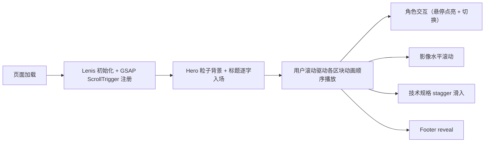

## 1. Product Overview

一款以《明日方舟：终末地》风格为灵感的单页游戏官网，通过 Apple 发布会级别的丝滑滚动转场动画，呈现沉浸式视觉体验。

- 目标用户：游戏玩家、游戏宣发团队、对交互动画敏感的设计爱好者
- 产品价值：通过高水准的滚动动画与视觉叙事，提升游戏品牌认知度与期待值

## 2. Core Features

### 2.1 Feature Module

1. **Hero 降临区**：Three.js 粒子背景 + 标题逐字卷帘入场 + 镜头推进转场
2. **世界观信号解码**：雷达扫描 SVG 动画 + 地形点阵汇聚 + 无缝衔接转场
3. **角色干员档案**：剪影点亮 + 六边形能力雷达图弹性放大 + 3D 翻转角色切换
4. **影像记忆回廊**：垂直滚动映射水平位移 + 焦点项高亮放大 + 纵深推入
5. **技术系统架构**：动态网格背景 + 参数 stagger 滑入 + 3D 几何体翻转
6. **Footer**：标准 reveal 动画

### 2.2 Page Details

| Page Name | Module Name | Feature description |
|-----------|-------------|---------------------|
| 单页官网 | Hero "降临" | Three.js 粒子星云背景，主标题逐字卷帘入场，向下滚动时镜头推进缩小过渡到下一区 |
| 单页官网 | 世界观"信号解码" | 雷达扫描圆环动画 + 地形点阵从随机到汇聚形成轮廓 + 文字块错位 reveal |
| 单页官网 | 角色"干员档案" | 黑白剪影鼠标交互点亮，六边形雷达图弹性动画，卡片 3D flip 切换不同干员 |
| 单页官网 | 影像"记忆回廊" | 横向滚动画廊由垂直滚动距离驱动，当前项放大 + 非当前项虚化 + 透视景深 |
| 单页官网 | 技术"系统架构" | 网格线动态生成，规格参数卡片 stagger 滑入，3D 几何图形 scroll-driven 翻转 |
| 单页官网 | Footer | Logo reveal + 联系方式淡入 + 版权信息 |

## 3. Core Process

用户打开页面 → Hero 粒子背景加载 + 标题逐字显现 → 向下滚动触发 Lenis 平滑惯性滚动 → 每个区块的 ScrollTrigger 时间线驱动对应动画 → 到达底部 Footer reveal → 用户可反向滚动反向播放动画

## 4. User Interface Design

### 4.1 Design Style

- **主色**：深邃太空黑 `#0A0A0F` / `#0D0D14`
- **强调色**：荧光黄 `#F5FF00` 搭配 霓虹青 `#00E5FF`
- **辅助色**：冷灰 `#1A1A24` `#2A2A3A` `#8A8A9A`
- **字体**：显示字体使用 Space Grotesk / Orbitron（粗体量级），正文使用 Geist Sans / Inter
- **布局**：全屏 section 堆叠，内容居中 12 列网格，大量负空间
- **动效基调**：极缓 ease-out，stagger 0.05-0.15s，长过渡时长 (1.2-2s)，大量 3D 透视与模糊

### 4.2 Page Design Overview

| Page Name | Module Name | UI Elements |
|-----------|-------------|-------------|
| 单页官网 | Hero | 全屏粒子 canvas、居中大标题 (clamp: 3rem-8rem)、副标题、向下滚动指示器、角标 |
| 单页官网 | 世界观 | 左侧雷达 SVG，右侧点阵轮廓地图，中间解码进度条 + 文字描述 |
| 单页官网 | 角色 | 三个角色剪影卡片、能力六边形雷达图、名字/代号/职业标签、切换按钮 |
| 单页官网 | 影像 | 横向滚动卡片画廊（6-8 张）、卡片悬停放大、滚动进度指示 |
| 单页官网 | 技术 | 背景网格线、3×3 参数卡片（CPU/GPU/RAM/Storage 等）、右上角 3D 几何体 |
| 单页官网 | Footer | Logo、社交图标行、版权文本、返回顶部按钮 |

### 4.3 Responsiveness

- **Desktop (≥ 1280px)**：完整动画与 3D 粒子效果，多列布局
- **Tablet (768-1279px)**：简化粒子数量，两列布局，保留核心滚动动画
- **Mobile (< 768px)**：降级为静态背景，单列堆叠，简化 3D 效果为 2D，保留关键 reveal 动画
- 触摸交互优化：去除部分 hover 态，改为 touch-active 响应

### 4.4 3D Scene Guidance

- **Hero 粒子场**：Three.js Points，5000-10000 粒子，随机分布 + 缓慢旋转 + 滚动驱动位移
- **粒子材质**：Additive blending，圆形 sprite，透明度随距离衰减
- **摄像机**：PerspectiveCamera，fov 60，滚动驱动 z 轴推进与轻微 rotation
- **光照**：无需光源（自发光粒子），使用 Fog 营造纵深
- **性能**：粒子数量响应式降级（移动端 1500），InstancedMesh 优化几何体
- **后期**：轻微 UnrealBloomPass，提升荧光颗粒感
- **角色 3D flip**：CSS 3D transform + preserve-3d，非 Three.js
