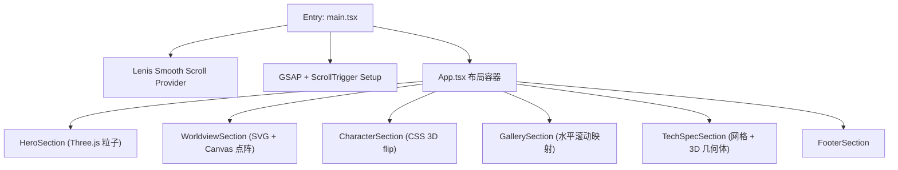

## 1. Architecture Design

单页前端应用，无后端依赖。动画系统由 Lenis 接管原生滚动，GSAP ScrollTrigger 驱动时间线。



## 2. Technology Description

- **前端框架**：React 18 + TypeScript 5.4
- **构建工具**：Vite 5.x
- **样式方案**：Tailwind CSS 3.x（配合 CSS variables 定义主题）
- **动画引擎**：GSAP 3.x + ScrollTrigger 插件
- **平滑滚动**：@studio-freight/lenis 1.x
- **3D 渲染**：three 0.160+（纯 three.js，非 R3F，保证轻量与控制精度）
- **后端**：无（纯静态单页）
- **状态管理**：轻量级组件内 useState，无需全局 store

### 2.1 动画时间线规范（滚动百分比驱动）

| 区块 | 阶段 | 滚动进度 | 动画 |
|------|------|----------|------|
| Hero | 入场 | 0-10% | 标题逐字 translateY(120%) → 0 |
| Hero | 推进 | 10-40% | 粒子 camera.position.z 推进 + blur 渐增 |
| Hero → Worldview | 转场 | 40-60% | 整屏 scale 0.9 → 1 + opacity 淡出 |
| Worldview | 解码 | 60-75% | 雷达扫描 0→360°，点阵随机→汇聚 |
| Worldview | 文字 | 75-90% | 文案 stagger reveal |
| Character | 点亮 | 90-110% | 剪影由灰→彩 mask reveal |
| Character | 能力 | 110-130% | 六边形数据由 0 展开 |
| Gallery | 水平 | 130-160% | translateX 0 → -80vw |
| Tech | 网格 | 160-180% | opacity 0 → 1 + line-dashoffset |
| Tech | 卡片 | 180-200% | stagger translate-y -40 → 0 |
| Footer | reveal | 200-220% | 标准底部淡入 |

### 2.2 缓动函数规范

- 入场 reveal：`power3.out`
- 滚动驱动转场：`none`（线性）或 `power1.inOut`
- 弹性放大：`back.out(1.7)` 或 `elastic.out(1, 0.5)`
- 淡出退场：`power2.in`

## 3. Route Definitions

| Route | Purpose |
|-------|---------|
| / | 单页官网主内容（所有 section 顺序堆叠） |

## 4. File Structure

```
/workspace
├── src/
│   ├── main.tsx              # 入口：Lenis + GSAP 注册
│   ├── App.tsx               # 页面主容器 + 所有 section
│   ├── index.css             # Tailwind + CSS variables + 全局样式
│   ├── components/
│   │   ├── sections/
│   │   │   ├── HeroSection.tsx
│   │   │   ├── WorldviewSection.tsx
│   │   │   ├── CharacterSection.tsx
│   │   │   ├── GallerySection.tsx
│   │   │   ├── TechSpecSection.tsx
│   │   │   └── FooterSection.tsx
│   │   └── ui/
│   │       ├── ParticleBackground.tsx  # Three.js 粒子
│   │       ├── RadarScan.tsx           # SVG 雷达
│   │       ├── HexRadar.tsx            # 六边形能力图
│   │       └── TechGrid.tsx            # 网格背景
│   └── hooks/
│       ├── useLenis.ts
│       └── useScrollTrigger.ts
├── public/
├── index.html
├── vite.config.ts
├── tailwind.config.js
├── postcss.config.js
├── tsconfig.json
└── package.json
```

## 5. Dependencies

```json
{
  "gsap": "^3.12.5",
  "@studio-freight/lenis": "^1.0.42",
  "three": "^0.160.0",
  "@types/three": "^0.160.0",
  "lucide-react": "^0.344.0"
}
```

## 6. Performance Budget

- 总 JS bundle（gzip）< 400KB
- LCP < 2.5s
- FPS 在滚动动画时 ≥ 50
- Three.js 粒子数量响应式降级：desktop 8000 / tablet 3500 / mobile 1500
- 使用 `will-change: transform` 仅在动画期间，动画结束后移除
- `requestAnimationFrame` 合并到 Lenis 的 raf 回调
- 监听 `visibilitychange`，页面隐藏时暂停 three.js 渲染循环

## 7. 响应式策略

- 使用 Tailwind `@screen` / `md:` `lg:` 前缀
- 关键 JS 响应式：`window.matchMedia('(min-width: 1024px)')` 决定是否启用完整 3D
- 所有滚动动画在 `prefers-reduced-motion` 时降级为瞬时 reveal
